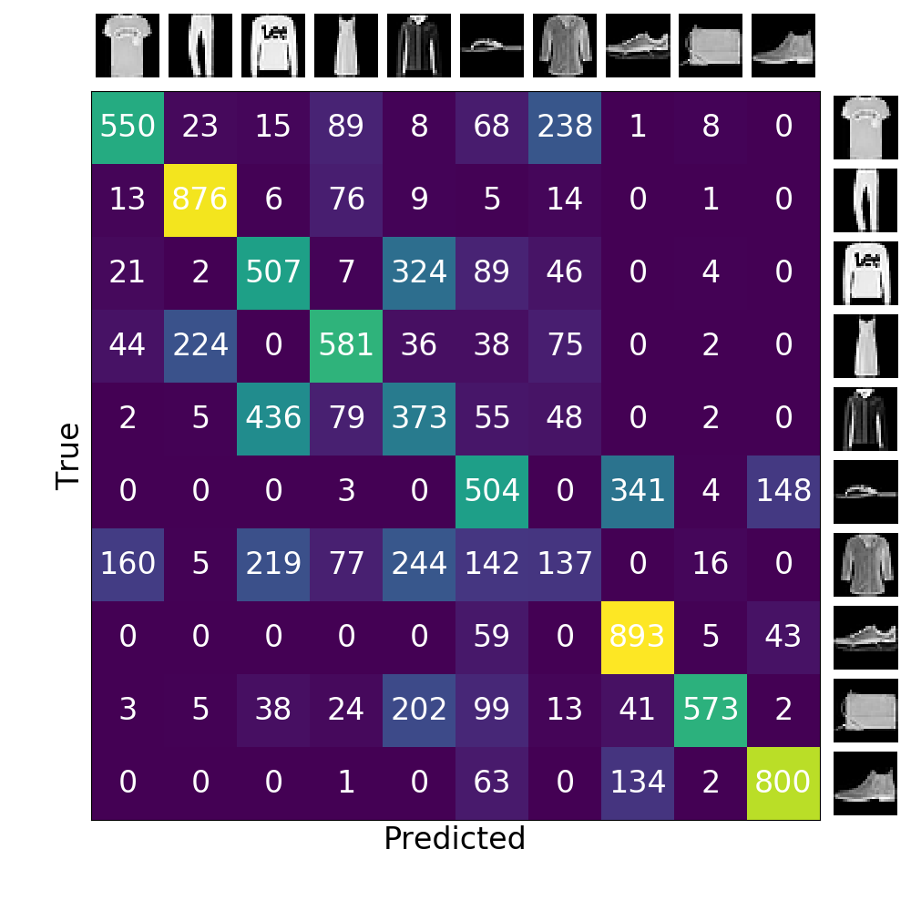

## Using Deep Convolutional Autoencoder for Semi-Supervised Image Classification

### Datasets

<a href="http://yann.lecun.com/exdb/mnist">MNIST<a>  &nbsp; |  &nbsp;
<a href="https://github.com/zalandoresearch/fashion-mnist">Fashion MNIST<a> &nbsp; |  &nbsp;
<a href="https://cs.stanford.edu/~acoates/stl10">STL-10<a>

### MNIST Results

TODO

### Fashion MNIST Results

### STL-10 Results

