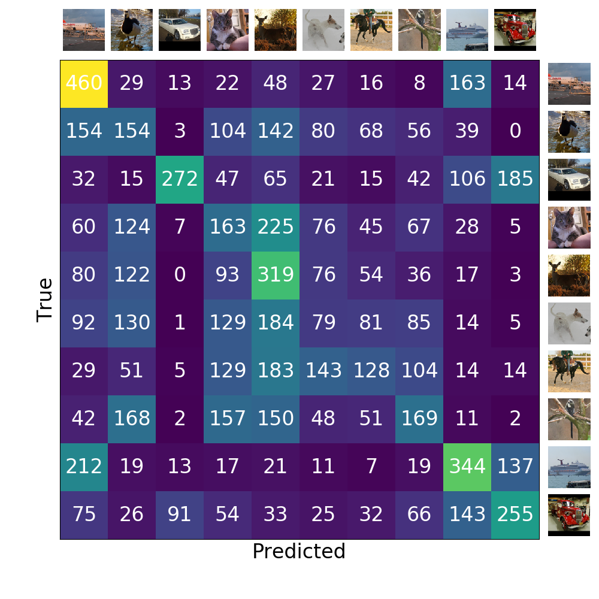

## Using Deep Convulutional Autoencoder for Unsupervised Image Classification

### Datasets

[MNIST](http://yann.lecun.com/exdb/mnist) &nbsp; |  &nbsp;
[Fashion MNIST](https://github.com/zalandoresearch/fashion-mnist) &nbsp; | &nbsp;
[STL-10](https://cs.stanford.edu/~acoates/stl10)

